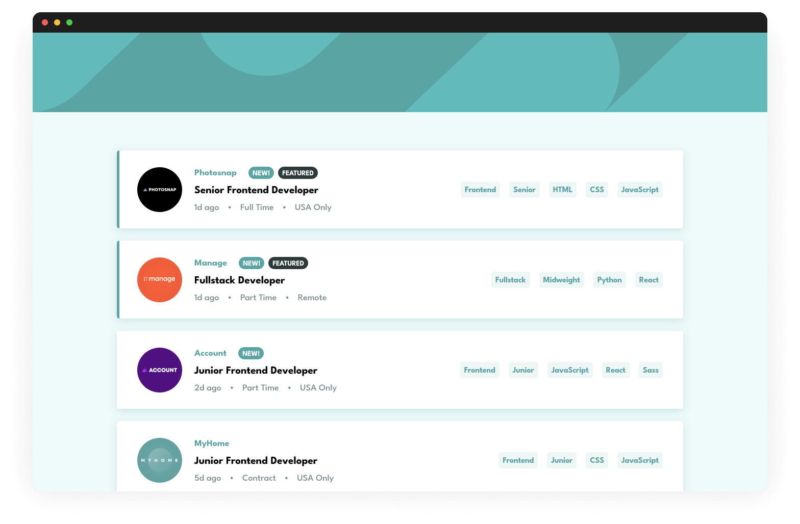
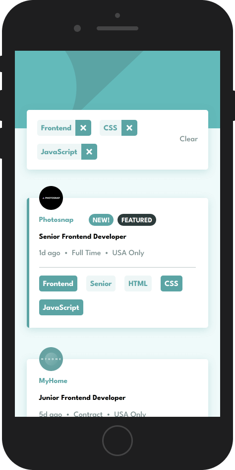
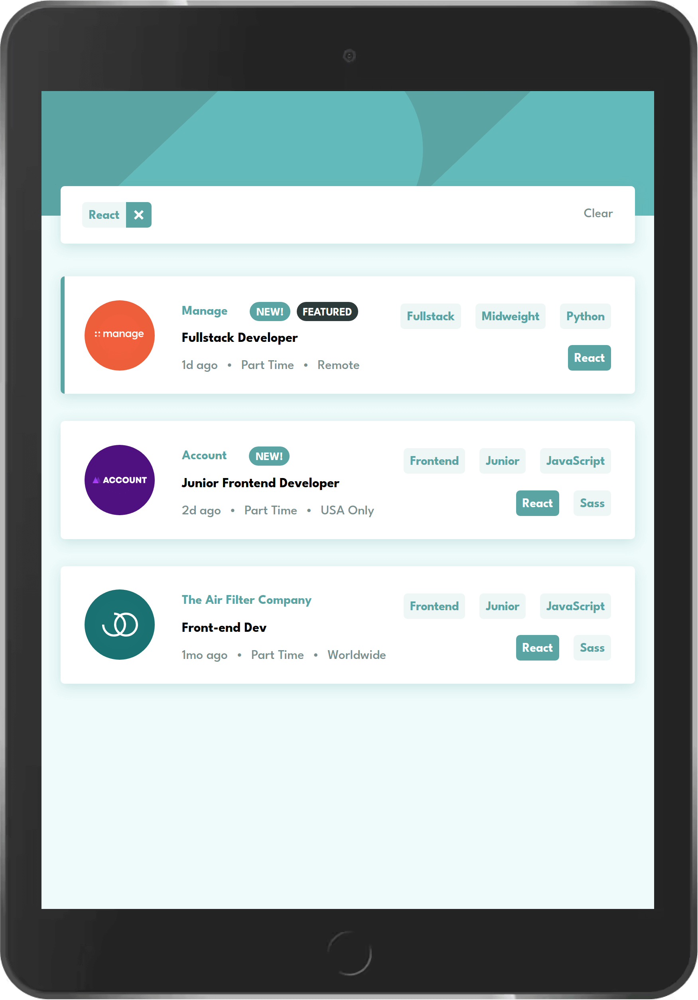

# Frontend Mentor - Job listings with filtering solution

This is a solution to the [Job listings with filtering challenge on Frontend Mentor](https://www.frontendmentor.io/challenges/job-listings-with-filtering-ivstIPCt). Frontend Mentor challenges help you improve your coding skills by building realistic projects.

## Table of contents

- [Overview](#overview)
  - [The challenge](#the-challenge)
  - [Screenshots](#screenshots)
  - [Links](#links)
- [My process](#my-process)
  - [Built with](#built-with)
  - [Continued development](#continued-development)
  - [Useful resources](#useful-resources)
- [Author](#author)

## Overview

### The challenge

Users should be able to:

- [x] View the optimal layout for the site depending on their device's screen size
- [x] See hover states for all interactive elements on the page
- [x] Filter job listings based on the categories

### Screenshots

**Mobile**

**Tablet**

### Links

- Solution URL: https://www.frontendmentor.io/solutions/job-listings-with-filtering-using-svelte-and-sveltekit-z-iBbuMc6E
- Live Site URL: https://papaya-kulfi-d7ee3b.netlify.app

## My process

### Built with

- Svelte and SvelteKit
- Mobile-first workflow

### Continued development

A couple of things I could try:

- Add transitions using `svelte/transition`
- Implement client-side routing by setting the active filters as search parameters, e.g., `?filter=frontend,css,javascript`

### Useful resources

- [A (more) Modern CSS Reset - Andy Bell](https://andy-bell.co.uk/a-more-modern-css-reset/)
- [Solving Sticky Hover States with @media (hover: hover) - CSS-Tricks](https://css-tricks.com/solving-sticky-hover-states-with-media-hover-hover/)

## Author

- Website - [Josh Javier](https://joshjavier.com/)
- Frontend Mentor - [@joshjavier](https://www.frontendmentor.io/profile/joshjavier)
